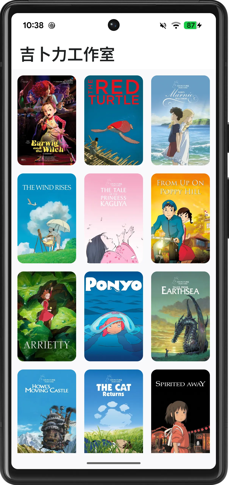
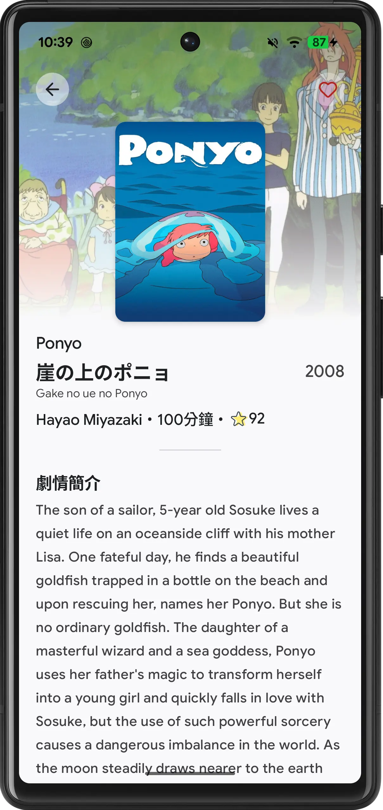
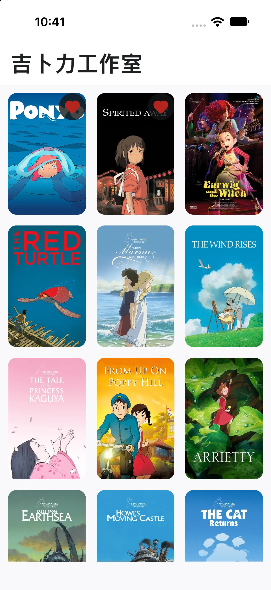
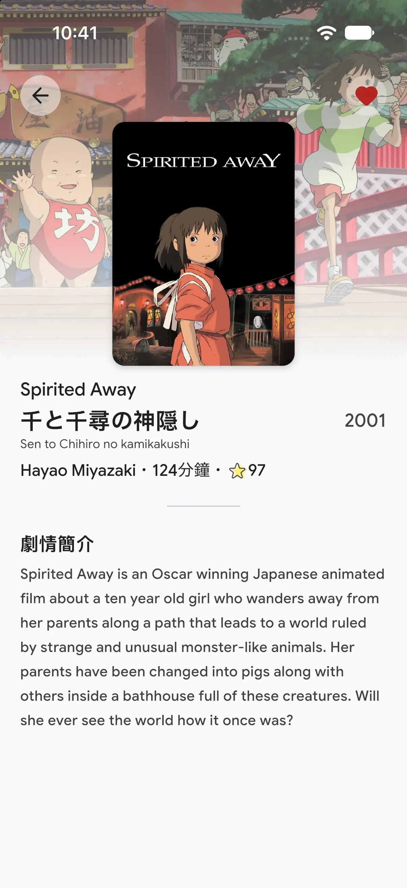

# Studio Ghibli 🍃

Studio Ghibli is a modern, cross-platform movie catalog application for **Android** and **iOS**, crafted with **Kotlin Multiplatform (KMP)**, **Compose Multiplatform**, and industry-standard **Clean Architecture**. It showcases the complete collection of legendary Studio Ghibli animations with a resilient offline-first caching mechanism, smooth shared element transitions, and full multi-language localization.

> [!NOTE]
> All movie data is provided by the public [Studio Ghibli API](https://ghibliapi.dev/#).

---

## ✨ Features

- **🎬 Ghibli Film Showcase**: Browse all iconic Studio Ghibli films ordered by release date, complete with original Japanese titles, romanized titles, release years, running times, and Rotten Tomatoes scores.
- **✨ Shared Element Transitions**: Smooth, visually appealing hero image transitions between the film grid and the detail screen powered by Compose Multiplatform `SharedTransitionScope`.
- **💾 Offline-First Architecture**: 
  - Local database powered by **Room (KMP)** as the Single Source of Truth.
  - Smart cache validity checking via **Preferences DataStore** (`dataExpired` variable with 7-day TTL).
  - Skips redundant remote requests when cached data is valid; automatically synchronizes with the remote API when expired or upon first launch.
- **❤️ Favorites & Bookmarking**: Mark films as favorites. Existing favorite states are strictly preserved even during data re-syncs (`upsertFilmsPreservingFavorites`).
- **🔄 Pull-to-Refresh**: Built with Material 3's official `PullToRefreshBox` for manual forced synchronization, resetting the cache expiration timer upon success.
- **🌍 Internationalization (i18n)**: Fully localized strings in:
  - English (`values`)
  - Traditional Chinese 繁體中文 (`values-zh-rTW` & `values-zh`)
  - Japanese 日本語 (`values-ja`)
- **🎨 Modern Typography & UI**: Custom Google Sans and Noto Sans JP font families, dynamic Material 3 color theming, and edge-to-edge layout.

---

## 🛠 Tech Stack

| Domain | Technology / Library | Description |
|---|---|---|
| **Language & Platform** | [Kotlin Multiplatform](https://kotlinlang.org/docs/multiplatform.html) (2.4.x) | Shared logic & UI targeting Android and iOS |
| **UI Framework** | [Compose Multiplatform](https://www.jetbrains.com/lp/compose-multiplatform/) (1.12.x) | Declarative UI with Material 3 & Shared Transition API |
| **Dependency Injection** | [Koin](https://insert-koin.io/) (4.2.x) | Koin Core, Koin Compose, and ViewModel injection |
| **Networking** | [Ktor Client](https://ktor.io/) (3.1.x) | Multiplatform HTTP client (OkHttp on Android, Darwin on iOS) |
| **Serialization** | [Kotlinx Serialization](https://github.com/Kotlin/kotlinx.serialization) | JSON serialization for API responses |
| **Local Database** | [Room Database](https://developer.android.com/training/data-storage/room) (2.8.x KMP) | Multiplatform SQLite with KSP and bundled SQLite driver |
| **Key-Value Storage** | [Preferences DataStore](https://developer.android.com/topic/libraries/architecture/datastore) (1.2.x) | Multiplatform DataStore for cache expiration (`dataExpired`) |
| **Image Loading** | [Coil 3](https://coil-kt.github.io/coil/) (3.1.x) | Multiplatform async image loader with Ktor 3 integration |
| **Navigation** | [Navigation Compose](https://developer.android.com/guide/navigation/navigation-compose) | Type-safe declarative Compose Navigation |
| **Splash Screen** | [androidx.core:core-splashscreen](https://developer.android.com/develop/ui/views/launch/splash-screen) | Android 12+ backward-compatible splash screen |
| **API Provider** | [Studio Ghibli API](https://ghibliapi.dev/#) | Film metadata, director, producer, banners, and descriptions |

---

## 🏗 Architecture

The project strictly follows **Clean Architecture** principles and the **MVI (Model-View-Intent)** presentation pattern across multiplatform modules:

```text
shared/
├── commonMain/
│   ├── app/                      # Navigation root & routing definitions
│   ├── core/
│   │   ├── domain/               # Pure Kotlin contracts (models, repositories, error types)
│   │   │   ├── datasource/       # Local and Remote DataSource interfaces
│   │   │   ├── datastore/        # AppDataStore interface (dataExpired)
│   │   │   ├── model/            # Film domain models
│   │   │   ├── repository/       # FilmRepository interface
│   │   │   └── util/             # Result wrapper, DataError, TimeProvider
│   │   ├── data/                 # Implementations and data coordination
│   │   │   ├── datastore/        # DefaultAppDataStore & multiplatform DataStoreFactory
│   │   │   ├── local/            # Room Database, DAOs, Entities, and Mappers
│   │   │   ├── remote/           # Ktor HTTP client, DTOs, and RemoteDataSource
│   │   │   └── repository/       # OfflineFirstFilmRepository (coordinates DB + Remote + Cache TTL)
│   │   ├── di/                   # Koin modules (CoreModule, PlatformModule expect)
│   │   └── presentation/         # Shared Theme, Typography, Colors, and UiText
│   └── film/
│       ├── presentation/
│       │   ├── film/             # Films list screen, FilmViewModel, FilmState, FilmAction
│       │   └── detail/           # Film detail screen, FilmDetailViewModel, FilmDetailState
│       └── di/                   # Film Koin module
├── androidMain/                  # Android PlatformModule (OkHttp, Android DataStore, Room)
└── iosMain/                      # iOS PlatformModule (Darwin, iOS DataStore, Room)
```

### ⏱ Smart Cache & Data Expiration Strategy
1. **Initial Launch**: `dataExpired` starts at `0L`.
2. **TTL Validation**: When the film list initializes, `OfflineFirstFilmRepository` compares the current epoch time with `dataExpired`.
3. **Cache Hit**: If `currentTime < dataExpired`, remote calls are skipped and films are read directly from local Room DB.
4. **Cache Miss / Expired**: If `currentTime >= dataExpired` (or on forced pull-to-refresh), data is fetched from the Studio Ghibli API.
5. **Preserving Favorites**: Local records are updated using `upsertFilmsPreservingFavorites`, ensuring user favorites are never lost.
6. **TTL Extension**: Upon successful remote sync, `dataExpired` is extended by **7 days** (`currentTime + 7 days`).

---

## 📸 Screenshots

### 📱 Android
| Home Screen | Film Details |
|:---:|:---:|
|  |  |

### 🍏 iOS
| Home Screen | Film Details |
|:---:|:---:|
|  |  |

---

## 🎥 Demo Videos

| Android Demo | iOS Demo |
|:---:|:---:|
| <video src="./videos/android_video.mp4" width="300" controls></video><br>[▶ Watch / Download Android Video](./videos/android_video.mp4) | <video src="./videos/ios-video.mp4" width="300" controls></video><br>[▶ Watch / Download iOS Video](./videos/ios-video.mp4) |

---

## 🚀 Setup & Running

### Prerequisites
- **JDK 17 or 21**
- **Android Studio** (Ladybug / Meerkat or later) with Kotlin Multiplatform plugin
- **Xcode** (for running the iOS application on macOS)

### Clone & Build
```bash
git clone https://github.com/encorex32268/StudioGhibli.git
cd StudioGhibli
```

- **Run Android**:
  ```bash
  ./gradlew :androidApp:assembleDebug
  ```
  Or select `androidApp` from Android Studio's run configuration dropdown.

- **Run iOS**:
  Open the `iosApp` directory in Xcode:
  ```bash
  open iosApp/iosApp.xcodeproj
  ```
  Select an iOS simulator or connected device and run.

---

## 🧪 Testing

The shared module contains unit tests covering repository caching logic, data expiration, and database favorite preservation:

```bash
# Run unit tests
./gradlew :shared:testAndroidHostTest
```

**Key Test Suites**:
- `OfflineFirstFilmRepositoryTest`:
  - Initial load with `0L` fetches remote and sets `dataExpired = now + 7 days`.
  - Non-expired cache skips remote requests.
  - Expired cache triggers remote fetch and refreshes TTL.
  - Network errors preserve the previous expiration state without updating.
  - Manual pull-to-refresh (`forceRefresh = true`) forces remote synchronization.
- `RoomFilmLocalDataSourceTest`:
  - Verifies that updating cached data preserves `isFavorite = true`.

---

## 📜 Acknowledgements & License

- Movie metadata and artwork courtesy of the [Studio Ghibli API](https://ghibliapi.dev/#).
- All Studio Ghibli character and film copyrights belong to **Studio Ghibli Inc.**
- Open source and developed for personal exploration of modern mobile multiplatform architecture.

**Author**: [LiHan](https://github.com/encorex32268)  
**Repository**: [StudioGhibli](https://github.com/encorex32268/StudioGhibli)